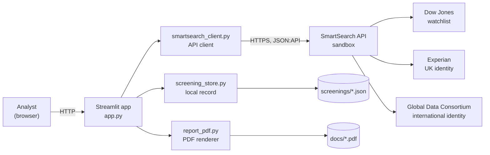
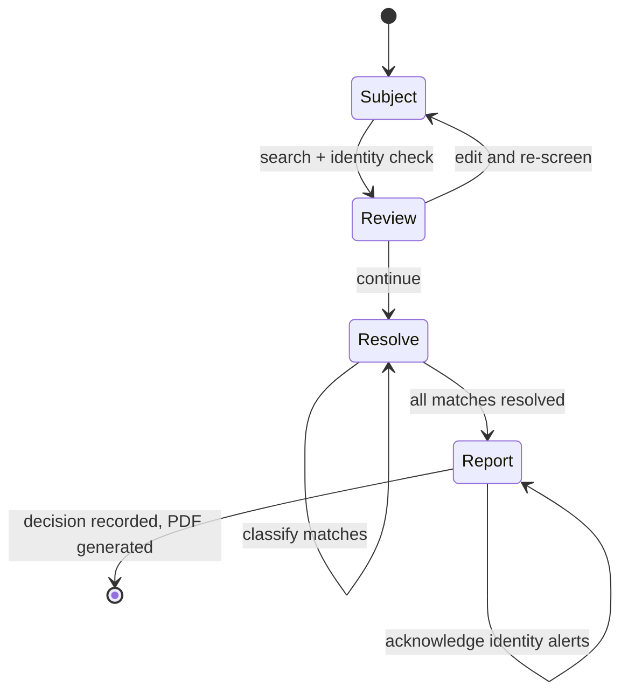

# High Level Design: SmartSearch AML Screening POC

Status: proof of concept, complete. Scope is a single-analyst desktop tool that takes one
individual from an unscreened name to a filed, auditable AML decision.

## 1. Purpose

Prove that the SmartSearch API can support a complete AML screening workflow end to end, and
surface the constraints that a production integration will have to design around. The POC is
deliberately a working system rather than a spike: it produces a real, signed-off document
against a real subject, because the gaps only become visible when you try to finish the job.

**In scope.** Individual person screening. Identity verification. Watchlist match
adjudication. A final decision with an audit trail. A PDF report.

**Out of scope.** Entity and company screening, multi-user access, a case queue, ongoing
monitoring, and the adjacent SmartSearch services (Fraud Check, SmartDoc, Source of Funds,
UBO, Document Request).

## 2. System context

The system has no database, no server-side session and no inbound network surface. It is a
single-process desktop application that talks outbound to one API and writes to the local
filesystem.

## 3. Components

| Component | Responsibility | Depends on |
|---|---|---|
| `app.py` | Presentation and workflow state only. Makes no HTTP calls of its own. | client, store, pdf |
| `smartsearch_client.py` | Every API concern: auth, token refresh, routing, parsing, error taxonomy, pagination, polling. Contains no Streamlit and no filesystem access. | requests |
| `screening_store.py` | The screening record, the resolution vocabulary, the audit trail, persistence, and the decision gates. No HTTP, no Streamlit. | stdlib |
| `report_pdf.py` | Renders a stored screening to PDF. Reads the store's models, never the API. | reportlab, store, client models |

The dependency rule is one-directional and deliberate: the client and the store know nothing
about each other or about the UI, so the client lifts into another project unchanged and the
store can be swapped for a database without touching either.

## 4. The workflow

Two gates control progress, and both exist because an AML screen that can be completed
carelessly is worse than no screen at all:

1. **The Report step is unreachable until every match is classified.** Enforced in the store,
   not the UI, so it cannot be bypassed.
2. **`ACCEPT` is blocked while identity verification carries unacknowledged alerts.**
   `REJECT` and `ESCALATE` are always available.

## 5. Key design decisions

| Decision | Rationale |
|---|---|
| Route by country: `GBR` to UK Individual AML, everything else to International | The UK route is a strict superset for UK subjects, returning the identical watchlist matches plus a credit-reference check, for one search. Verified: same 9 refs for Nicholas Brown on both routes. |
| Local JSON is the system of record | The API has exactly one resolution write (`is_true_match`). It has no field for risk, reason, comment or a final decision, so those must live somewhere else. |
| Provider sync is best effort, never blocking | A provider failure must not lose the classification an analyst just made. Sync outcome is recorded per match rather than retried silently. |
| Poll `meta.is_processing` before reading matches | The search returns `status: complete` while the watchlist is still writing. Reading immediately returns an empty list, which on an AML screen is a false negative. |
| Identity attention keys on alerts, not on the outcome | Verified: a subject returns `outcome: pass` while carrying a deceased flag and a fraud alert. On the International route every result is `refer`, so the outcome is meaningless in both directions. |
| Profiles are snapshotted onto the record when a match is resolved | The report needs the primary name and gender, which exist only on the per-match profile call. Snapshotting also freezes what the analyst actually saw. |
| Fields the API never populates are labelled, not hidden | `match_strength`, `match_name` and `Sources` are always empty. Rendering "Not provided" tells an integrator where the gaps are; hiding them implies the data was checked and found absent. |

## 6. Constraints imposed by the API

These shaped the design and are not implementation choices:

- **No name-only screen.** Date of birth and a full address are mandatory in practice, and
  validation is country-specific: a USA subject additionally needs a state, a telephone
  number and a national ID.
- **Screening is asynchronous and does not say so.** The only completion signal is
  `meta.is_processing` on the watchlist subject.
- **Watchlist match IDs are subject-scoped.** They change on every re-screen; `meta.ref` is
  the stable provider identifier and is what carries resolutions across a re-screen.
- **The profile payload is an untyped recursive `{label, data[]}` tree.** Section names
  appear nowhere in the spec, so the renderer walks whatever arrives rather than mapping
  known fields.
- **The two routes run structurally different identity checks.** The International route has
  no deceased check and no fraud alert.

## 7. Non-functional position

| Concern | POC position |
|---|---|
| Authentication | Bearer JWT, 900 second lifetime, cached with 60 seconds of headroom, one automatic retry on 401 |
| Error handling | Four typed exceptions mapped to distinct UI treatments. No stack trace reaches the screen. |
| Persistence | Atomic write (temp file then `os.replace`). Append-only audit trail. Monotonic revision counter. |
| Concurrency | None. Single user, single process. No locking on the JSON files. |
| Rate limiting | None implemented; the API documents no `429` and no limits. |
| Secrets | Read from `.env` via `python-dotenv`, never logged or rendered. |
| Observability | The audit trail is the only record. No metrics, no structured logs. |

## 8. Known gaps for production

Carried forward deliberately rather than solved here:

1. The local JSON store is not a regulated audit system. It needs a real database with
   retention, access control and tamper evidence.
2. No multi-user access, no case queue, no work allocation.
3. Webhooks are not implemented. Note that the callback reports **search** status, not
   watchlist readiness, so it must be paired with the `is_processing` check rather than
   replacing it.
4. No ongoing monitoring, which makes every screen point-in-time.
5. Only Experian is returned on this contract. A flag held only by Equifax or TransUnion is
   invisible.
6. No backoff or retry policy beyond the single 401 replay.

Detail and evidence for all of these is in `docs/api-findings.md`; the route-level comparison
is in `docs/route-comparison.md`.
