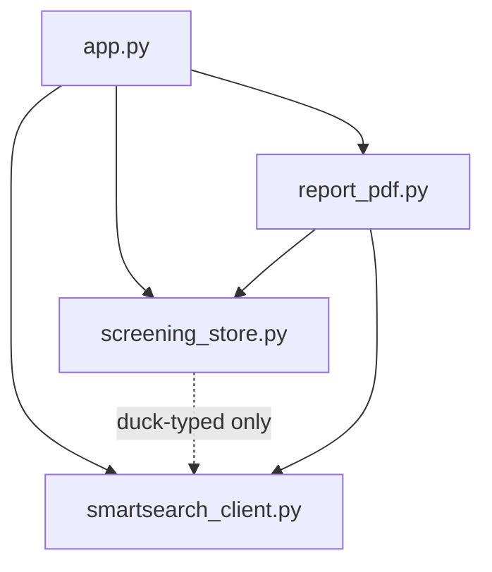
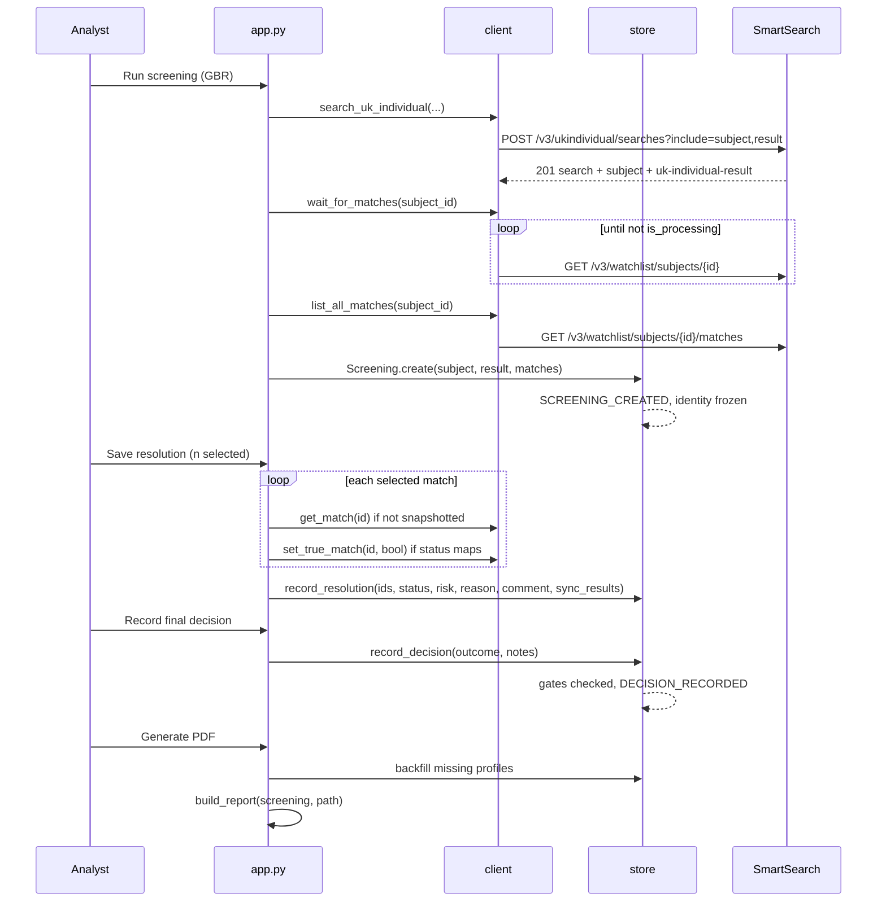

# Low Level Design: SmartSearch AML Screening POC

Companion to `docs/HLD.md`. Documents the code as it stands, module by module.

```
app.py                 1091 lines   Streamlit UI and workflow state
smartsearch_client.py   846 lines   API client, models, error taxonomy
screening_store.py      592 lines   record, vocabulary, audit, persistence, gates
report_pdf.py           548 lines   ReportLab renderer
```

## 1. Dependency rules



`smartsearch_client` imports nothing from the project. `screening_store` imports nothing from
the project either: it accepts search results and profiles duck-typed, which is why it can be
unit tested without the API. Only `app.py` and `report_pdf.py` compose the others.

## 2. `smartsearch_client.py`

### 2.1 Transport

```python
SANDBOX_BASE = "https://api.sandbox.app.smartsearch.com"
JSONAPI      = "application/vnd.api+json"
TOKEN_REFRESH_HEADROOM = 60      # refresh this many seconds before exp
TOKEN_FALLBACK_LIFETIME = 840    # used when the JWT will not decode
```

`SmartSearchClient(app_id, secret, base_url=SANDBOX_BASE, timeout=30)`

| Method | Purpose |
|---|---|
| `_fetch_token()` | `POST /v3/auth/token`, reads `meta.token`, decodes `exp` from the JWT |
| `_ensure_token()` | Returns the cached token unless within 60s of expiry |
| `_request(method, path, json_body, params, _retried)` | Adds auth and JSON:API headers; on `401` clears the token and replays **once**; maps status to exceptions |
| `_handle(resp)` | Status to exception mapping (below) |
| `token_expires_in` | Seconds remaining, for the sidebar |

`_decode_jwt_exp` tolerates the trailing padding SmartSearch emits by trimming to the last
`}` before parsing.

### 2.2 Error taxonomy

| HTTP | Exception | UI treatment |
|---|---|---|
| 400 | `ValidationError` | `field_errors` maps `source.pointer` to form fields, rendered inline |
| 401, 403 | `AuthError` | Credentials message |
| 500, 503 | `ServiceError` | Retry prompt; note this sandbox returns 500 for missing permissions |
| other, network | `SmartSearchError` | Generic message |

`ValidationError.field_errors` turns `/data/attributes/address/street_1` into
`address.street_1`, which is what lets a 400 land on the right input.

### 2.3 Search methods

```python
search_individual(first, last, address, dob, title, middle,
                  client_reference, telephone, national_ids) -> SearchResult
search_uk_individual(first, last, addresses, dob, title, middle,
                     documents, client_reference)            -> SearchResult
```

Both `POST` with `?include=subject,result` and return a `SearchResult` carrying
`route` and a parsed `identity`. `search_uk_individual` strips `country` from each address,
because the UK route rejects it with `HTTP 400 "Unexpected field"`. Bank details are
deliberately never sent: this contract answers `400 "Bank checks are not allowed"`.

### 2.4 Watchlist methods

| Method | Endpoint |
|---|---|
| `watchlist_summary(subject_id)` | `GET /v3/watchlist/subjects/{id}` |
| `list_matches(subject_id, page, size)` | `GET /v3/watchlist/subjects/{id}/matches` |
| `list_all_matches(subject_id)` | Pages through the above |
| `get_match(match_id)` | `GET /v3/watchlist/matches/{id}?include=associations` |
| `set_true_match(match_id, bool)` | `PATCH /v3/watchlist/matches/{id}` |
| `list_true_matches(subject_id)` | `GET /v3/watchlist/subjects/{id}/true-matches` |
| `wait_for_matches(subject_id, timeout=30, interval=2)` | Polls `meta.is_processing` |

### 2.5 The identity model

`IdentityResult` is one container for two shapes, discriminated by `kind`:

```python
KIND_UK            = "uk-cra"
KIND_INTERNATIONAL = "international-corroboration"

@dataclass
class IdentityResult:
    outcome: str; checks: list; raw: dict; kind: str = KIND_UK
```

| | `IdentityCheck` (UK) | `CorroborationCheck` (International) |
|---|---|---|
| Model | Authentication | Corroboration |
| Key fields | `cra`, `authentication_index`, `primary_check_count`, `deceased_check`, `potential_fraud_alert`, `paf_check`, `documents`, `documents_errors` | `number_of_sources`, `source_limit_reached`, `field_grades`, `national_ids` |
| `alerts` | Any failed check, plus a raised fraud alert and any failed document | `number_of_sources == 0` only |

`needs_attention` is deliberately asymmetric:

```python
if self.kind == KIND_INTERNATIONAL:
    return bool(self.alerts)              # every result is "refer"; outcome means nothing
return self.outcome.lower() != "pass" or bool(self.alerts)
```

**Flag polarity** is the single most dangerous detail in this codebase and lives in one place,
`IDENTITY_FLAGS` plus `INVERTED_IDENTITY_FLAGS`, consumed by both the UI and the PDF so they
cannot drift:

| Field | `true` means |
|---|---|
| `deceased_check`, `paf_check`, `name_and_address_match`, `identity_confirmation_level` | check **passed** |
| `potential_fraud_alert` | alert **raised** |

Established by probing a persona the data pack lists as deceased and fraud-flagged against one
it lists as clean. `identity_flag_label(key, value) -> (label, is_bad)` is the only sanctioned
way to render them.

## 3. `screening_store.py`

### 3.1 Vocabulary

```python
STATUSES = ["UNSPECIFIED", "POSITIVE", "POSSIBLE", "FALSE"]
RISKS    = ["UNKNOWN", "LOW", "MEDIUM", "HIGH"]
REASONS  = ["Full Match", "Partial Match", "Name Match Only", "Date of Birth Mismatch",
            "Nationality Mismatch", "Citizenship Mismatch", "Country Mismatch",
            "Auto-Resolved", "Unknown", "Other"]
OUTCOMES = ["ACCEPT", "REJECT", "ESCALATE"]
STATUS_TO_TRUE_MATCH = {"POSITIVE": True, "FALSE": False}   # others have no API equivalent
```

### 3.2 Record schema

`screenings/<screening_id>.json`

```jsonc
{
  "screening_id": "<uuid4>", "revision": 13, "report_version": 1,
  "status": "SCREENED | RESOLVED | DECIDED",
  "created_at": "...", "created_by": "...", "updated_at": "...", "updated_by": "...",
  "subject":  { form fields as submitted, including display_name },
  "search":   { "search_id", "subject_id", "group_id", "status", "created_at",
                "provider_types": ["WATCHLIST"], "route": "uk-individual" },
  "identity": { "route", "kind", "outcome", "needs_attention", "alerts": [],
                "checks": [ ... ], "checked_at", "raw" },
  "identity_acknowledged": false,
  "matches": [ { "match_id", "ref", "summary", "categories", "meta",
                 "profile": { "sections", "meta", "associations", "snapshotted_at" },
                 "resolution": { "status", "risk", "reason", "comment", "resolved_at",
                                 "resolved_by", "source", "synced", "sync_error" } } ],
  "decision": { "outcome", "reviewer", "decided_at", "notes",
                "identity_outcome", "identity_acknowledged" },
  "audit":    [ { "event_id", "type", "occurred_at", "actor", "revision", ...payload } ]
}
```

`needs_attention` and `alerts` are **frozen at check time** rather than recomputed on read,
because the record is a point-in-time artefact and the reviewer acknowledged the verdict as it
stood when they saw it.

### 3.3 Persistence

`save()` writes to `<path>.tmp` then `os.replace`, so a crash cannot truncate an existing
record. Every mutation calls `_bump(actor)` (revision + 1, `updated_at`, `updated_by`) and
appends exactly one audit event.

### 3.4 Audit events

`SCREENING_CREATED`, `SUBJECT_RESCREENED`, `PROFILE_SNAPSHOTTED`, `IDENTITY_CHECKED`,
`IDENTITY_ACKNOWLEDGED`, `RESOLUTION_RECORDED`, `DECISION_RECORDED`, `REPORT_GENERATED`.

A bulk classification produces **one** `RESOLUTION_RECORDED` event carrying `match_ids` and
`result_count`, not one per match.

### 3.5 The two gates

Both live in `record_decision`, in the store rather than the UI:

```python
if not self.all_resolved:
    raise ValueError(f"{self.unresolved_count} match(es) still unresolved; ...")
if outcome == "ACCEPT" and self.identity_needs_attention and not self.identity_acknowledged:
    raise ValueError("Identity verification needs attention (...). Acknowledge it before accepting.")
```

### 3.6 Re-screen semantics

`rescreen()` keeps the same `screening_id` and carries resolutions across by **`meta.ref`**,
not by match ID, because a new search mints new match IDs for the same watchlist entries. It
clears `decision` and `identity_acknowledged`, since neither applies to a new match set.

### 3.7 Provider sync

```python
sync_status_to_provider(client, match_id, status) -> (synced, error)
```

Returns `(None, None)` when the status has no API equivalent, which is **not** a failure and
is reported as "not applicable". Catches every exception: a provider problem must never lose
the local resolution.

## 4. Sequence: a full screening



## 5. `app.py`

### 5.1 Session state

| Key | Purpose |
|---|---|
| `step` | 1 to 4, drives the render |
| `screening` | The live `Screening` object; persists itself on mutation |
| `error` | `{kind, message, fields, local}` for the banner |
| `sel_<match_id>` | One per match checkbox on the Resolve step |
| `clear_selection` | Deferred clear flag, see below |
| `res_status`, `res_risk`, `res_reason`, `res_comment` | Resolution panel |
| `decision_outcome`, `decision_notes`, `ack_identity` | Report step |
| `report_path` | Path of the last generated PDF |

**Deferred selection clear.** Streamlit forbids writing a widget's state after it has been
instantiated, and the resolution panel renders after the checkboxes. `save_resolution` sets
`clear_selection = True`; the flag is consumed at the top of `step_resolve` on the next run,
before any checkbox exists.

**Errors must trigger a rerun.** The error banner renders near the top of the script, before
the step body, so `run_search` calls `st.rerun()` after recording an error. Without it the
error is set too late to be seen.

### 5.2 Render functions

| Function | Notes |
|---|---|
| `render_data(data, label, depth)` | Walks the untyped `{label, data[]}` profile tree. Special cases Images, long-form sections, and one-level-deep nodes flattened into a table. Recurses on anything deeper. |
| `render_identity(record)` | Shared header and alert block, then branches on `kind` |
| `render_corroboration(identity)` | International: source metrics, field grade matrix grouped Name / DOB / Address / Contact, national IDs, sources found |
| `render_match(index, record, client, selectable)` | Card. `selectable` adds the queue checkbox. |
| `step_subject / step_review / step_resolve / step_report` | One per wizard step |

## 6. `report_pdf.py`

`build_report(screening, path) -> Path`, ReportLab platypus, chosen over an HTML engine
because it has no system dependencies.

| Section | Function |
|---|---|
| 1 Report metadata | `_metadata` |
| 2 Subject details | `_subject` |
| 3 Screening parameters | `_parameters`, route label from `ROUTE_LABELS` |
| 4 Identity verification | `_identity`, branches to `_corroboration` on `kind` |
| 5 Match summary | `_summary` |
| 6 Match details | `_matches` then `_match_block` per match |
| 7 Final decision | `_decision` |
| Appendix A Audit trail | `_audit` |

Two shared primitives carry most of the document: `kv_table(rows)` for label/value pairs and
`grid_table(header, rows)` for tabular data, both `LongTable` so they page correctly across a
59-match report.

`REPORT_GENERATED` is appended **after** the PDF is built, so the audit appendix legitimately
ends one event short. A report cannot contain the record of its own creation.

## 7. Test strategy

No test framework is shipped. Verification is by `streamlit.testing.v1.AppTest` driving the
real app against the live sandbox, which is what caught every real bug in this build:

| Suite | Covers |
|---|---|
| Wizard | Full four-step walk, 9 matches, gates, PDF, reload |
| Edge | Zero-match subject, blank postcode validation, re-screen carrying resolutions |
| Identity | GBR pass panel, flagged subject gating ACCEPT, non-GBR corroboration panel |
| PDF | Text decoded back out of the PDF and asserted section by section |

The PDF assertions decode the generated file rather than trusting the renderer, using an
ASCII85 plus Flate extractor, because ReportLab compresses its content streams.

## 8. Extension points

| To add | Where |
|---|---|
| A new jurisdiction route | A `search_*` method on the client returning `SearchResult` with `route` and `identity`; the store and UI need no change |
| A new identity model | A third check dataclass plus a `kind` constant; branch in `render_identity` and `_identity` |
| A database instead of JSON | Replace `Screening.save/load/list_saved`. Nothing else touches the filesystem. |
| Webhooks | `create_webhook`, `list_webhooks`, `delete_webhook` on the client. Pair with `wait_for_matches`, do not replace it. |
| A case queue | `GET /v3/search/subjects-listing`; `Screening.list_saved` already returns the local equivalent |
